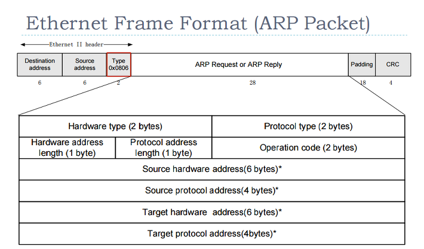
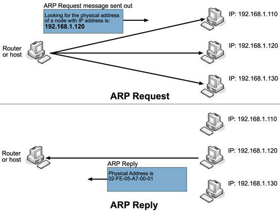

# Tổng quan về ARP 
Một máy tínhđược gán cho 2 địa chỉ:
- IP: địa chỉ các giao thức mạng, có thể thay đổi. Sử dụng để tìm ra đường kết nối trong hệ thống mạng.
- MAC: địa chỉ định danh ***duy nhất*** cho mỗi thiết bị. Địa chỉ MAC không phân lớp nên khó để định tuyến.

ARP là phương thức phân giải địa chỉ động giữa địa chỉ IP và địa chỉ lớp MAC.
Giao thức này được định nghĩa trong RFC826

## Các loại bản tin ARP
- Request: Khởi tạo quá trình, gói tin được gửi từ thiết bị nguồn A tới thiết bị đích B.
- Reply: Phản hồi gói tin ARP request được gửi từ máy đích B đến máy nguồn A. 

## Cấu trúc gói tin ARP

- Hardware Type: xác định bộ giao tiếp phần cứng cần biết với giá trị 1 cho Ethernet.
- Protocol Type: kiểu giao thức địa chỉ máy gửi
- HLEN: độ dài địa chỉ vật lý MAC
- PLEN: độ dài địa chỉ IP
- Sender Hardware Address : Địa chỉ MAC thiết bị gửi
- Sender Protocol Address : Địa chỉ IP của thiết bị gửi bản tin.
- Target Hardware Address : Địa chỉ MAC của thiết bị nhận bản tin
- Target Protocol Address : IP của thiết bị nhận bản tin.

# Cơ chế hoạt động

- Bước 1: Thiết bị nguồn A kiểm tra cache của mình. Nếu có địa chỉ IP đích tương ứng với MAC nào đó thì chuyển qua bước 9.
- Bước 2: khởi tạo gói tin ARP Request với các trường địa chỉ.
- Bước 3: Thiết bị nguồn quảng bá gói tin ARP Request trên toàn mạng.
- Bước 4: Các thiết bị trong mạng đều nhận được gói tin ARP request. Gói tin xử lý bằng cách tìm địa chỉ Target Protocol Address. Nếu trùng với địa chỉ của mình thì tiếp tục xử lý. Nếu không trùng thì hủy gói tin.
- Bước 5: Thiết bị trùng IP khởi tạo ARP Reply 
  - Lấy Sender Hardware Address và Sender Protocol Address trong gói tin nhận làm Target cho ARP Reply
  - Lấy địa chỉ MAC của mình đưa vào Sender Hardware Address
- Bước 6: Cập nhật bảng ánh xạ địa chỉ IP và MAC của thiết bị nguồn vào bảng ARP Cache của mình
- Bước 7: gửi gói tin ARP Reply. Gói tin Reply là gói tin gửi unicast.
- Bước 8: Thiết bị nguồn A nhận gói tin reply. Lưu trường Sender Hardware Address như địa chỉ phần cứng của thiết bị đích B
- Bước 9: Thiết bị nguồn A update vào ARP giá trị tương ứng địa chỉ IP và MAC của thiết bị đích B. Lần sau không cần request.

# Phân tích bản tin ARP sử dụng wireshark
 

## Resource
- https://vnpro.vn/thu-vien/arp-address-resolution-protocol-va-qua-trinh-phan-phoi-goi-tin-trong-mang-3123.html
- https://www.mystown.com/2016/12/arp-la-gi-tim-hieu-ve-giao-thuc-arp-arp.html?m=1
- https://github.com/locvx1234/ARP