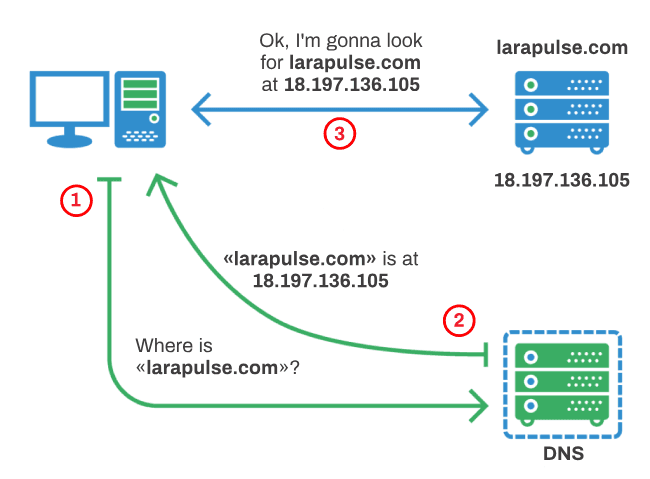
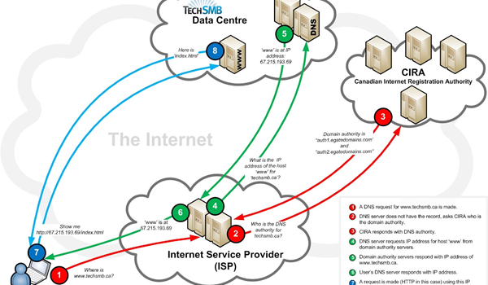
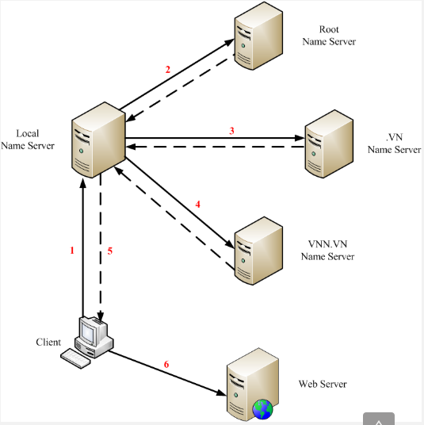
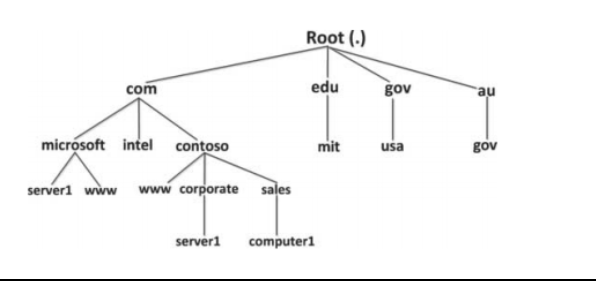
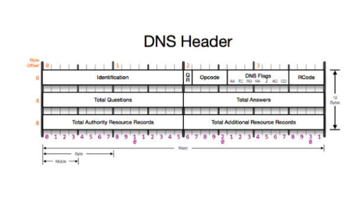
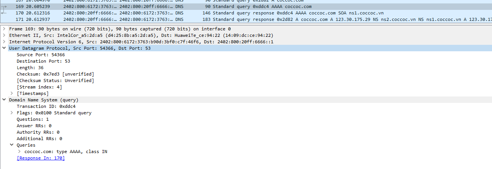
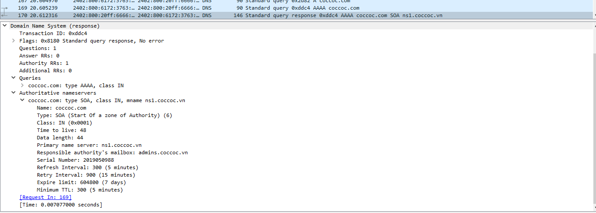

# DNS là gì?
DNS (Domain Name System - Hệ thống tên miền) hệ thống cho phép thiết lập địa chỉ IP và tên miền trên Internet. Hệ thống DNS chuyển đổi các tên miền website ở dạng www.tenmien.com sang địa chỉ IP tương ứng và ngược lại.

## Chức năng của DNS
DNS như người `phiên dịch` và `truyền đạt thông tin`. DNS dịch tên miền thành địa chỉ IP gồm 4 nhóm số khác nhau. Ví dụ `google.com.vn` thành `74.125.236.37` 
Hệ thống tên miền hoặc domain là tên của website hoạt động trên internet thay thế địa chỉ IP dài và khó nhờ thành một `Domain` hay `tên miền` dễ nhớ.
Mỗi máy tính, máy chủ trên Internet đều có 1 địa chỉ IP duy nhất thiết lập kết nối giữa server và client. DNS đóng vai trò liên kết với các thiết bị mạng cho các mục đích định vị và địa chỉ hóa các thiết bị trên Internet.
Ví dụ: Nhập URL `google.com` DNS server truy xuất địa chỉ IP máy chủ google thiết lập liên kết để hiển thi giao diện trang chủ - Quá trình phân giải tên miền (DNS Resolution).

# Nguyên tắc hoạt động của DNS

Giả sử bạn muốn truy cập vào trang google.com
- Client gửi request tìm kiếm địa chỉ IP tương ứng với domain google.com tới máy chủ quản lý tên miền cục bộ của mạng - local name server.
- Server cục bộ kiểm tra trong database của nó có chứa domain không. Nếu có thì trả về IP của máy có tên miền đó. Ngược lại sẽ hỏi các máy chủ tên miền ở mức cao hơn.
- Máy chủ ROOT chỉ cho máy chủ cục bộ địa chỉ của server quản lý tên miền đuôi `.com`.
- Máy chủ cục bộ gửi yêu cầu để tìm tên miền cho `google.com`
- Máy chủ quản lý các tên miền có đuôi `.com` trả về địa chỉ IP cho client.

# Kiến trúc DNS
## Không gian tên miền

Hệ thống DNS là hệ thống dạng phân tán và phân cấp hình cây có đỉnh Root. Khi client truy vấn tên miền sẽ đi lần lượt từ root phân cấp xuống dưới để đến DNS quản lý domain cần truy vấn.

## Cú pháp đặt tên miền
Tên miền có dạng: `label.label...label` với độ dài tối đa là 255 ký tự. Mỗi label tối đa là 63 ký tự bao gồm cả dấu `.` 
Ví dụ `google.com` thì google là một tên miền con của `com`.

### Phân loại tên miền
- com: tổ chức thương mại
- edu: tổ chức giáo dục
- net: tổ chức mạng lớn
- gov: tổ chức chính phủ
- org: các tổ chức khác
- int : tổ chức quốc tế
- info: phục vụ thông tin
- mil: tổ chức quân sự, quốc phòng
- travel: tổ chức du lịch
- post: tổ chức bưu chính

Mã các nước trên thế giới tham gia vào mạng internet được quy định bằng hai chữ cái theo tiêu chuẩn ISO-3166 (Việt Nam là `.vn`)

## Cấu trúc gói tin DNS

- ID: có độ dài 16bits chứa mã nhận dạng, được tạo ra bởi một chương trình thay thế cho các truy vấn. Dựa vào ID để phản hồi lại các request từ client
- QR: trường 1 bit. Thiết lập mặc định là 0 với gói tin truy vấn, 1 với gói tin phản hồi
- Opcode: trường 4 bits thiết lập cho cờ hiệu là 0, truy vấn ngược là 1, tình trạng truy vấn là 2.
- AA: gói tin hồi đáp là 1 sau đó đến server có thẩm quyền xử lý truy vấn
- TC: cho biết gói tin có bị phân đoạn khi vượt quá băng thông cho phép.
- RD: yêu cần server tiếp tục truy vấn đệ quy
- RA: Truy vấn đệ quy có được thực thi hay không
- Z: trường dữ trự, thiết lập là 0
- Rcode: gói tin phản hồi có thể nhận các giá trị sau
 - 0: quá trình truy vấn success
 - 1: định dạng gói tin lỗi, server không hiểu truy vấn
 - 2: Server lỗi không thực hiện phản hồi
 - 3: Tên bị lỗi. Chỉ server mới thiết lập giá trị này
 - 4: Không thực hiện
 - 5: Server từ chối thực thi
- QDcount: số lần truy vấn gói tin
- ANcount: Số lượng tài nguyên tham gia phản hồi
- ARcount: số lượng tài nguyên ghi lại trong phần thêm vào gói tin
- NScount: số lượng tài nguyên ghi lại trong các phần có thẩm quyền

# Bắt gói tin DNS

Trang web đang truy vấn coccoc.com, máy client hỏi máy server - request 169. Dữ liệu tương ứng là UDP/53 

Server trả về các thông số mà client yêu cầu - response 170

## Resource
- https://aws.amazon.com/vi/route53/what-is-dns/
- https://wiki.matbao.net/kb/dns-la-gi-tam-quan-trong-cua-dns-trong-the-gioi-mang/
- https://vietnetwork.vn/microsoft-dns/tu-hoc-mcse-2016-lab-3-cau-hinh-dns-server-tren-windows-server-2016/

 