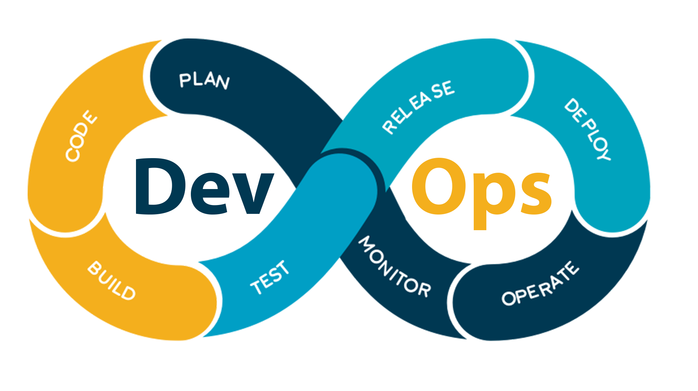
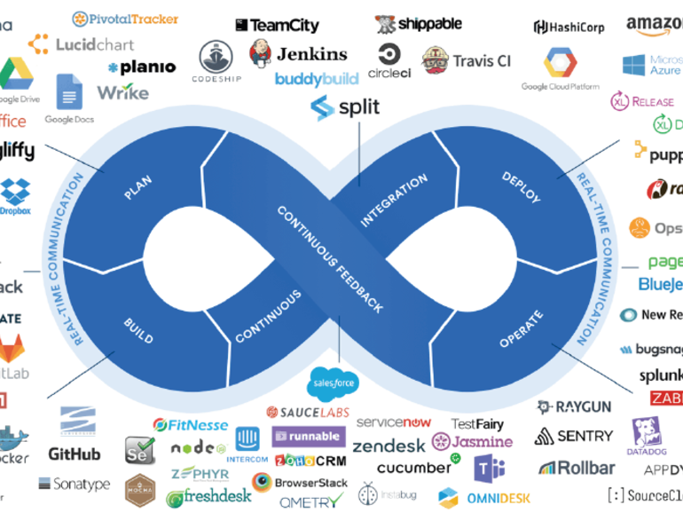
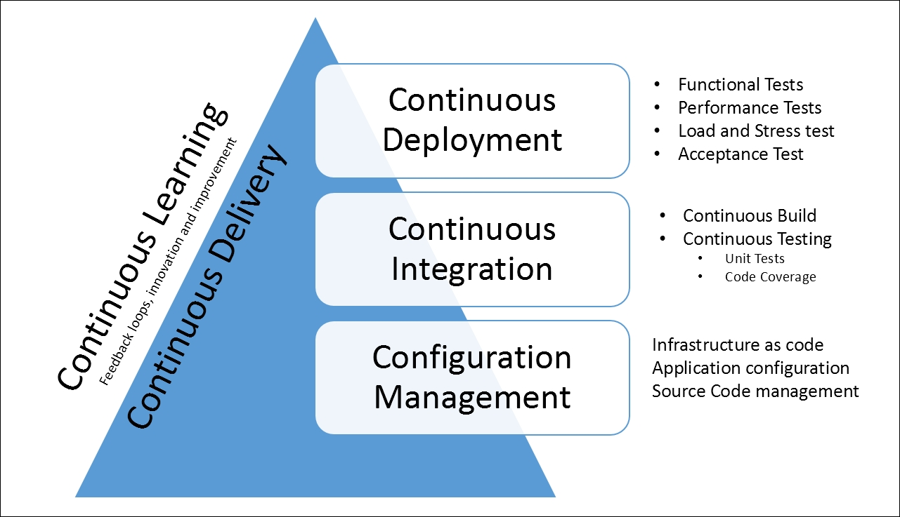

# What is the DevOps
DevOps is a set of practices that automates the processes between software development and IT teams, in order that they can build, test, and release software faster and more reliably.
The concept of DevOps is founded on building a culture of collaboration between teams that historically functioned in relative siloes. The promised benefits include increased trust, faster software releases, ability to solve critical issues quickly, and better manage unplanned work.

**At its essence, DevOps is a culture, a movement, a philosophy.**

It's a firm handshake between development and operations that emphasizes a shift in mindset, better collaboration, and tighter integration. It unites agile, continuous delivery, automation, and much more, to help development and operations teams be more efficient, innovate faster, and deliver higher value to businesses and customers.

## DevOps Lifecycle
Improve collaboration between all stakeholders from planning through delivery and automation of the delivery process in order to:

- Improve deployment frequency
- Achieve faster time to market
- Lower failure rate of new releases
- Shorten lead time between fixes
- Improve mean time to recovery

## The CALMS Framework for DevOps
- Culture: Own the change to drive collaboration and communication - People > Process > Tools
- Automatic: Take manual steps out of your value chain - Infastructure as Code
- Lean: Use lean principles to enable hinger cycle frequency - Focus on value and customer
- Measurement: Measure everything and use data to refine cycles. Show improvement.
- Sharing: Share experiences, success or not, to enable others to learn - Collaboration/Feedback.   

# DevOps Toolchain
A DevOps toolchain is a set or combination of tools that aid in the delivery, development, and management of software applications throughout the systems development life cycle, as coordinated by an organisation that uses DevOps practices.
Generally, DevOps tools fit into one or more activities, which supports specific DevOps initiatives: Plan, Create, Verify, Package Release, Configure, Monitor, and Version Control

## Stage of DevOps
- Plan: Plan is composed of two things: "define" and "plan". This phase helps define business value and requirements. Sample tools include Jira or Git to help track known issues and perform project management.
- Code: This phase involves software design and the creation of software code. Sample tools include GitHub, GitLab, Bitbucket, or Stash.
- Build:  manage software builds and versions, automated tools.  Sample tools include Docker, Ansible, Puppet, Chef, Gradle, Maven...
- Test: continuous testing (manual or automated) to ensure optimal code quality. 
- Deploy: manage, coordinate, schedule, and automate product releases into production.  Sample tools include Puppet, Chef, Ansible, Jenkins, Kubernetes, OpenShift, OpenStack, Docker, or Jira.
- Operate: manages software during production. Sample tools include Ansible, Puppet, PowerShell, Chef, Salt, or Otter.
- Monitor: involves identifying,  collecting information about issues from a specific software release in production.

# DevOps Practices

## Configuration management
Software applications and services need a physical or virtual environment on which they can be deployed. Configuration management helps in the following ways:
- Infrastructure as Code: automate the provisioning, configuration of infrastructure,  enables the provisioning of an environment multiple times in a consistent and predictable manner
- Deployment and configuration of an application: Configuration management stores values for the application configuration for each environment on which it is deployed.

##  Continuous integration
Continuous integration (CI) is a software engineering practice where members of a team integrate their work with increasing frequency. In keeping with CI practice, teams strive to integrate at least daily and even hourly, approaching integration that occurs “continuous-ly.”
## Continuous delivery
Continuous delivery (CD) is to packaging and deployment what CI is to build and test. Teams practicing CD can build, configure, and package software and orchestrate its deployment in such a way that it can be released to production in a software-defined manner (low cost, high automation) at any time.

# What is CI/CD in DevOps? And how are they related to Agile?

Engineering teams often start with CI because it’s in their wheelhouse. A DevOps focus can help organizations understand what configuration, packaging, and orchestration are necessary to software-define even more of the life cycle—creating a more valuable CD practice. The practice of CI/CD in DevOps, in turn, adds to agile development.
- Agile focuses on processes highlighting change while accelerating delivery.
- CI/CD focuses on software-defined life cycles highlighting tools that emphasize automation.
- DevOps focuses on culture highlighting roles that emphasize responsiveness.

## Resources
- https://en.wikipedia.org/wiki/DevOps_toolchain
- https://www.synopsys.com/blogs/software-security/agile-cicd-devops-difference/
- https://subscription.packtpub.com/book/networking_and_servers/9781786468550/1/ch01lvl1sec10/devops-practices
- https://blog.testlodge.com/what-is-devops/
- https://www.atlassian.com/devops