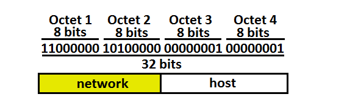
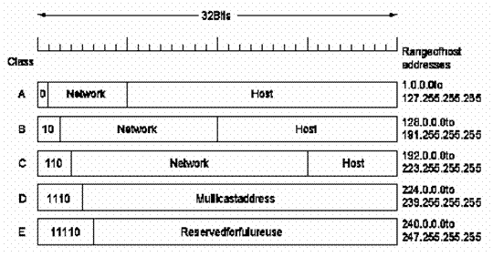
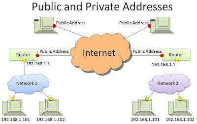

# IP là gì?
IP (Internet Protocol) là địa chỉ giao thức Internet để nhận biết mỗi máy tính trên mạng Internet. KHi giao tiếp với nhau trên Internet hoặc mạng LAN cục bộ mỗi máy tính có địa chỉ IP duy nhất.
Có 2 loại địa chỉ IP là IP LAN (192.168.x.x) và IP Modem

# Cấu tạo địa chỉ IPv4
Địa chỉ IP là dải nhị phân 32 bit chia thành 4 bộ 8 bit là các octet.
Địa chỉ IP gồm 2 phần: địa chỉ máy (hostID) và địa chỉ mạng (netID)

## Subnet Mask
Subnet Mask là dãy số dạng 32 bit hoặc 128 bit phân đoạn địa chỉ IP thành địa chỉ netID và hostID riêng biệt.
- Subnet mask có tất cả các bit network và subnet bằng 1, host bằng 0
- Các máy trên cùng 1 mạng phải có cùng subnet
- Phân biệt subnet dùng phép login `AND`

## Phân lớp địa chỉ IP

Địa chỉ IP phân thành 5 lớp. Các lớp phân biệt với nhau dựa vào số bit đầu và độ dài NetID, HostID của IP

- Lớp A: octet đầu tiên trong khoảng 1-126. Dải IP từ: 1.0.0.1 đến 126.0.0.0
- Lớp B: octet đầu tiên trong khoảng 128-191. Dải IP từ 128.0.0.0 đến 191.254.0.0
- Lớp C: octet đầu tiên trong khoảng 191-223. Dải IP từ 192.0.0.0 đến 223.255.254.0
- Lớp D: octet đầu tiên trong khoảng 128-191. Dải IP từ 128.0.0.0 đến 191.254.0.0
- Lớp E:
- Loopback: địa chỉ 172.x.x.x

# Phân loại địa chỉ IP

 Các loại IP thông dụng hiện nay là IP Private, IP Public, IP tĩnh, IP động. Mỗi loại IP có thể là địa chỉ IPv4 hoặc IPv6

- IP Private: thuộc mạng nội bộ, hỗ trợ các máy tính nội bộ liên kết với nhau. Thiết lập thủ công hoặc route chỉ định
- IP Public: kết nối mạng toàn cầu, bắt buộc khi truy cập công khai.

- IP tĩnh: cấu hình thủ công cho thiết bị, không hề thay đổi

- IP động: gán tự động cho từng kết nối. Việc gán tự động do máy chủ DHCP và bị thay đổi ở những lần kết nối tiếp theo.

# Resource 
- https://hostingviet.vn/ip-la-gi-ip-dong-ip-tinh-la-gi-cac-dang-ip-thuong-gap
- https://wiki.matbao.net/kb/ip-la-gi-tong-hop-moi-kien-thuc-can-biet-ve-dia-chi-ip/
- https://cuongquach.com/tu-hoc-ccna-dia-chi-ip-la-gi.html
- https://cuongquach.com/cau-hinh-ip-tinh-tren-centos-7.html