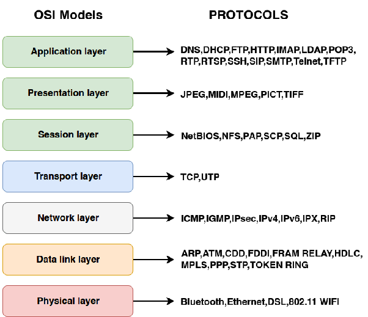
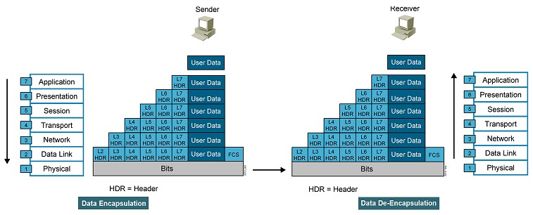

Các máy tính, thiết bị sử dụng mạng để giao tiếp với nhau cần có các mô hình giao tiếp giữa chúng. Hai mô hình là kiểu cũ và chuẩn hóa.

# Mô hình OSI
Mô hình OSI là mô hình mạng gồm 7 layer. Mỗi layer có một nhiệm vụ và chức năng cụ thể giúp tín hiệu được truyền đi nhanh chóng và bảo mật tuyệt đối.

## Các layer trong mô hình OSI
1. Physical: chuyển đổi dữ liệu thành các tín hiệu cơ, điện, quang thành các tín hiệu nhị phân (0,1) để truyền trên đường truyền vật lý.
2. Data Link: định nghĩa các cách thức đóng gói dữ liệu cho các loại đường truyền. Tương tác với các giao thức của lớp trên, tầng DataLink sử dụng địa chỉ MAC (Mac address-Physical address) là địa chỉ đặc trưng. Thiết bị họat động là SWITCH.
3. Network: đường định tuyến, tìm đường đi tối ưu nhất cho các thực thể. Sử dụng địa chỉ IP (Logical address ). Thiết bị đặc trưng là ROUTER
4. Transport: quản lý thực hiện các tác vụ truyền dữ liệu từ source đến destination. Đảm bảo truyền dữ liệu tối ưu nhất.  
5. Session: thiết lập, duy trì, kết thúc phiên làm việc giữa hai hệ thống. Xác lập ánh xạ giữa các tên địa chỉ tạo ra sự giao tiếp giữa các máy tính khác nhau trên cơ sở các giao dịch truyền thông.
6. Presentaion: chuyển đổi các thông tin từ cú pháp người sử dụng sang cú pháp để truyền dữ liệu. Lớp này có khả năng nén dữ liệu truyền và mã hóa trước khi truyền để đảm bảo an toàn.
7. Application: cung cấp các phương tiện cho người dùng truy cập và sử dụng các dịch vụ của mô hình OSI. Các giao thức ở tầng này: HTTP, FPT, SMTP...

## Quy trình xử lý dữ liệu trong mô  hình OSI
Mô hình OSI làm việc hai chiều được sử dụng khi một máy tính nào đó nhận dữ liệu mà dữ liệu đó đi ngược trở lên từ lớp vật lý. 

### Phía máy gửi
** Các dữ liệu tại máy gửi được xử lý theo trình tự sau: **

- Người dùng đưa các thông tin cần truyền đi như hình ảnh, văn bản vào máy tính.
- Dữ liệu được chuyển xuống tầng Presentaion, dữ liệu được chuyển thành một dạng chung để mã hóa và nén dữ liệu.
- Tại tầng Session: bổ sung thông tin cho phiên giao dịch (gửi-nhận).
- Sau khi tầng Session thực hiện xong, dữ liệu được chuyển xuống tầng Transport. Tại tầng này, dữ liệu được cắt nhỏ thành các Segment cũng làm nhiệm cụ bổ sung thông tin về phương thức vận chuyển dữ liệu đảm bảo tính bảo mật và tin cậy khi truyền.
- Dữ liệu chuyển xuống tầng Network, các segment tiếp tục được chia nhỏ thành các gói Package khác nhau đồng thời bổ sung thông tin định tuyến đường đi cho gói tin.
- Dữ liệu được chuyển xuống tầng Data Link, mỗi Package được băm nhỏ thành nhiều Frame và bổ sung thêm các thông tin kiểm tra gói tin chứa dữ liệu để kiểm tra ở máy nhận.
- Cuối cùng, các frame này được chuyển xuống tầng Physical được chuyển thành một chuỗi các bit nhị phân (0,1) đưa lên các phương tiện truyền dẫn(dây cáp) để truyền đến máy nhận.

### Phía máy nhận
- Máy nhận kiểm tra quá trình đồng bộ và đưa chuỗi nhị phân vào vùng đệm. Thông báo cho tầng Data Link đã nhận dữ liệu.
- Data Link kiểm tra các lỗi trong Frame nhận được từ máy gửi (kiểm tra FCS có trong gói tin được gắn bên máy nhận). Sau đó kiểm tra địa chỉ MAC xem có trùng với địa chỉ máy nhận không. Nếu đúng thì gỡ bỏ Header của tầng Data Link rồi chuyển lên tầng Network.
- Tầng network kiểm tra địa chỉ trong gói tin có phải địa chỉ máy nhận không (địa chỉ IP). Đúng thì gỡ bỏ Header rồi chuyển đến tầng Transport.
- Tầng Transport hỗ trợ phục hồi lỗi và xử lý lỗi bằng cách gửi gói tin ACK,NAK. Sau khi phục hồi sửa lỗi, tầng này sắp xếp thứ tự phân đoạn và đưa dữ liệu đến tầng Session.
- Tầng Session đảm bảo dữ liệu trong gói tin nhận được toàn vẹn. Tiến hành gỡ bỏ Header của tầng này rồi gửi đến tầng Presentation.
- Tầng Presentation xử lý gói tin bằng cách chuyển đổi định dạng dữ liệu phù hợp. Sau đó gửi đến tầng Application.
- Tầng Application tiến hành xử lý và gỡ bỏ Header cuối cùng. Máy nhận nhận được dữ liệu của gói tin được truyền đi.
## Resource
- https://medium.com/@totolinkvn/t%C3%ACm-hi%E1%BB%83u-c%C3%A1c-t%E1%BA%A7ng-li%C3%AAn-k%E1%BA%BFt-trong-m%C3%B4-h%C3%ACnh-osi-d8f498097e97