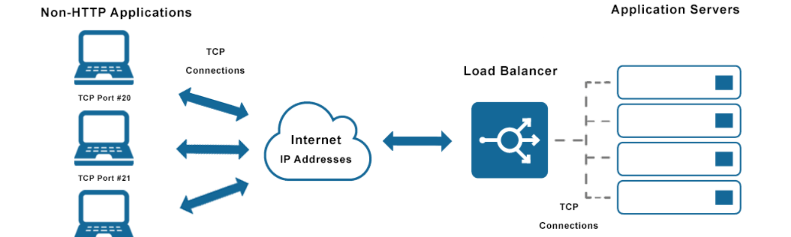
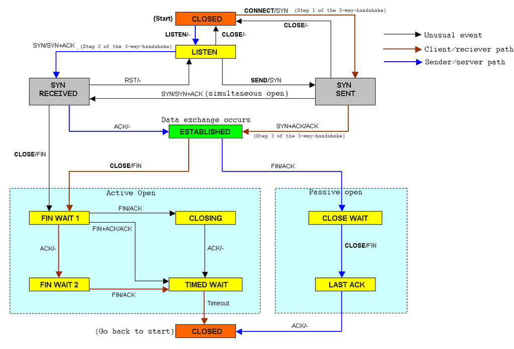
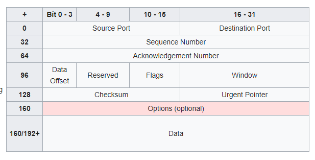
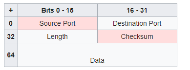

# TCP là gì?

TCP (Transmission Control Protocol) là giao thức giúp các máy chủ liên lạc với nhau để trao đổi dữ liệu hoặc các gói tin.
TCP đảm bảo dữ liệu được truyền tin cậy và đúng thứ tự. Có khả năng phân biệt dữ liệu của các ứng dụng cùng chạy trên một máy chủ

## Đặc điểm của TCP
- TCP là giao thức hướng kết nối - bắt buộc thiết lập kết nối để truyền dữ liệu
- Cơ chế đánh số thứ tự gói tin - loại bỏ trùng lặp
- Truyền và nhận dữ liệu cùng 1 lúc
- Cơ chế báo nhận (ACK)
- Phục hồi dữ liệu bị mất trên đường truyền

## Cách thức hoạt động của TCP
Giao thức TCP đòi hỏi thiết lập kết nối trước khi gửi dữ liệu và kết thúc kết nối khi dữ liệu hoàn tất. Các pha trạng thái của một socket

| Trạng thái | Hoạt động | TCP | 
|----------|-----|--------|
| LISTEN | đợi yêu cầu kết nối từ TCP và cổng | TCP server  | 
| SYN-SENT | đợi TCP gửi gói tin với cờ SYN và ACK được | TCP client | 
| SYN-RECEIVED | đợi TCP gửi tin báo nhận kết nối | TCP server | 
| ESTABLISHED | sẵn sàng nhận/gửi dữ liệu | TCP client & server | 
| TIME-WAIT | thời gian chờ kết thúc kết nối |  | 

### Thiết lập kết nối
TCP sử dụng quá trình bắt tay 3 bước để thiết lập kết nối.

- Server mở cổng kết nối (mở bị động). Client mở chủ động
- Quá trình bắt tay 3 bước:

 - Client gửi gói tin SYN yêu cầu mở cổng dịch vụ. Giá trị ngẫu nhiên X gán cho tham số sequence number.
 - Server phản hồi bản tin SYN-ACK, tham số acknowledgment number bằng X + 1, sequence number = Y
 - Client gửi bản tin ACK có tham số sequence number = X + 1, acknowledgment number = Y + 1 thông báo kết nối được thiết lập.

### Truyền dữ liệu
- Trong 2 bước đầu tiên, máy tính trao đổi số thứ tự gói tin ban đầu (ISN) chọn ngẫu nhiên đánh dấu các khối dữ liệu gửi từ mỗi máy tính.
- Sau mỗi byte truyền đi ISN tăng lên. Dữ liệu gửi hoàn tất được sắp xếp theo thứ tự.
- Trên thực tế, chỉ byte dữ liệu đầu tiên được gán số thứ tự, bên máy nhận sẽ gửi tin báo bằng cách gửi số thứ tự của byte đang chờ.
- Ví dụ: Máy gửi A gửi 4 byte có số thứ tự ban đầu = 100. 
 - Máy nhận B thông báo nhận nội dung 104 ngầm thông báo đã nhận được các byte 100, 101, 102, 103.
 - Nếu 2 byte cuối bị lỗi, bên B thông báo nhận nội dung 102 (nhận byte 100, 101)
 - Nếu byte đầu tiên gửi lỗi, gửi lại toàn bộ 10 gói.

### Kết thúc kết nối
- Sử dụng quá trình bắt tay 4 bước và độc lập chiều kết nối.
- Gói tin FIN thông báo muốn kết thúc kết nối, bên kia báo tin nhận ACK.
- Một kết nối có thể ở dạng ` nửa mở ` - một bên kết thúc gửi dữ liệu chỉ nhận thông tin, bên kia tiếp tục gửi.

# Các cổng TCP
TCP sử dụng `số hiệu cổng` để định danh ứng dụng gửi và nhận dữ liệu. FTP(21), TELNET (23), SMTP (25), HTTP (80).
Các cổng được dùng tạm thời khi kết nối với server hoặc định danh các dịch vụ được đăng kí bởi một bên thứ 3.

# Cấu trúc gói tin TCP

Một gói tin TCP gồm 2 phần: header (20 bytes - có 11 trường) và dữ liệu.

- Source port: số hiệu cổng máy gửi
- Destination port: số hiệu cổng máy nhận
- Sequence number: 
 - Nếu cờ SYN bật: số thứ tự gói ban đầu với byte đầu tiên gửi + 1.
 - Nếu không có cờ SYN: số thứ tự của byte đầu tiên.
- Data offset: độ dài header
- Reserved: giá trị 0
- Flags: bao gồm 6 cờ
 1. URG:cờ cho Urgent pointer
 2. ACK: cờ cho trường Acknowledgement
 3. PSH: hàm Push
 4. RST: thiết lập lại đường truyền
 5. SYN: đồng bộ lại số thứ tự
 6. FIN: không gửi thêm số liệu
- Window: số byte có thể nhận bắt đầu từ giá trị của ACK
- Checksum: kiểm tra header và dữ liệu

# UDP là gì?
UDP (User Datagram Protocol) là giao thức gửi tin đến các máy chủ trên Internet dưới dạng Datagram. 
UDP sử dụng cơ chế tối giản không kết nối.

## Cấu trúc gói tin UDP

UDP không đảm bảo gói tin được gửi đi và máy gửi không có trạng thái thông điệp UDP khi được gửi.
Header của UDP chưa 4 trường dữ liệu

- Source port: cổng máy gửi, không dùng thì bằng 0.
- Destination port: cổng máy nhận - bắt buộc
- Length: chiều dài toàn bộ datagram gồm header và dữ liệu.
- Checksum: kiểm tra lỗi của header và dữ liệu

## Một số thuật ngữ UDP

- Package: dữ liệu và tín hiệu điều khiển.
- Datagram: gói tin độc lập đầy đủ dữ liệu định tuyến
- MTU: maximum Transmission Unit - dữ liệu lớn nhất có thể truyền.
- Port: cổng ánh xạ dữ liệu đến vào một tiến trình đang chạy. DNS (53), TFTP (69)
- TTL (Time To Live): ngăn ngừa gói tin bị kẹt trong các vòng định tuyến. TTL = 0 datagram bị loại bỏ
- Multicasting: cho phép truyền tin theo kiểu một-nhiều (đài phát thanh, thư điện tử)

## Cách thức hoạt động của UDP

UDP không kết nối trực tiếp với máy nhận mà gửi dữ liệu ra dựa vào thiết bị trung gian. Khi dữ liệu gửi trên giao thức UDP được thêm một header 8 bytes chứa số hiệu cổng nguồn và đích, tổng chiều dài dữ liệu, thông tin checksum.
- Máy gửi gửi gói tin đến bên nhận một cách liên tục, Không chờ đợi bên nhận đã nhận được gói tin.
- Máy nhận nếu bỏ lỡ một số gói tin thì không thể yêu cầu gửi lại.
- Không thể kiểm soát gói tin được nhận, không thể yêu cầu gửi lại gói tin.
- Không thiết lập kết nối nên thời gian truyền tin nhanh hơn.

# So sánh TCP và UDP

UDP thiếu các tín hiệu bắt tay 3 bước, không đảm bảo dữ liệu đã đến đích hay chưa. 
Bản chất phi liên kết không hỗ trợ phiên duy trì liên kết giữa các host.
UDP không đảm bảo các đoạn dữ liệu gửi theo đúng thứ tự. TCP sử dụng số thứ tự cùng số hiệu cổng xác thực gói tin thường xuyên.
UDP không có kiểm soát luồng, giảm băng thông của mạng.

| Đặc trưng | UDP | TCP | 
|----------|-----|--------|
| Hướng liên kết | Không| Có | 
| Sử dụng phiên | Không| Có |
| Độ tin cậy | Không| Có |
| Xác thực | Không| Có |
| Đánh thứ tự | Không| Có |
| Điều khiển luồng | Không| Có |
| Bảo mật | Thấp | Cao |

## Resource
- https://medium.com/@totolinkvn/tìm-hiểu-về-giao-thức-tcp-và-udp-aeea11e538e6
- https://voer.edu.vn/m/hoat-dong-cua-giao-thuc-tcp/5d69fa44
- https://www.mystown.com/2016/10/udp-la-gi-su-khac-nhau-giua-giao-thuc.html?m=1
- https://cuongquach.com/tu-hoc-ccna-tim-hieu-giao-thuc-tcp-udp.html